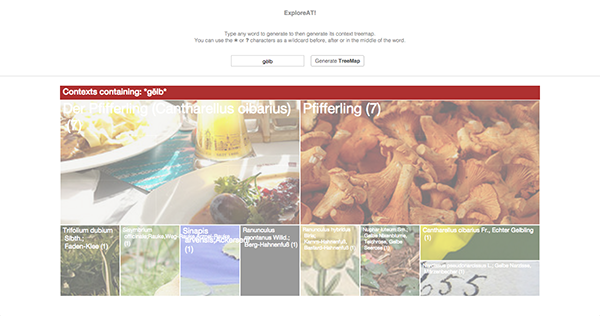

# Organism Navigator
_This project comes from the split of the original [exploreAT-collectionexplorer](https://github.com/acdh-oeaw/exploreAT-collectionexplorer) of [Alex Benito](https://github.com/ale0xb)_

Generate an image-aided treemap containing the most meaningful contexts where the searched lemma appears, and explore the occurences.

The tool allows the user to search for lemmas or parts of compounds, mostly related to living organisms. It groups findings according to the number of entries containing the search term with related pictures from Europeana. The larger the image displayed the more entries there are for a given term.



## Getting Started

These instructions will get you a copy of the project up and running on your local machine for development and testing purposes. See deployment for notes on how to deploy the project on a live system.

### Installing

Dependencies are been migrated from [Bower]() with [bower-away](). Therefore yarn or npm may be used for installing
the dependencies.

As indicated in **Bower** official site, it is recommended not to use it to manage the dependencies.

```
yarn
```
or
```
npm install
```

You can use any static server of your choice to serve the files for the webpage.
Additionally, [webpack](http://www.dropwizard.io/1.0.2/docs/) may be used for compiling the source code
and package it into a few files (friendlier with download speed for the webpage).

**This prototype needs for an ElasticSearch database, and an API for retrieving data from Europeana and Flickr.**

## Authors

* [Alex Benito](https://github.com/ale0xb) - *Implementation of the prototype* 
* [Alejandro Rodríguez](https://github.com/Janchorizo) - *Project split and migration to newer package managers* 

## License

This project is licensed under the MIT License - see the [LICENSE.md](LICENSE.md) file for details

